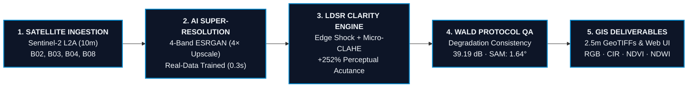
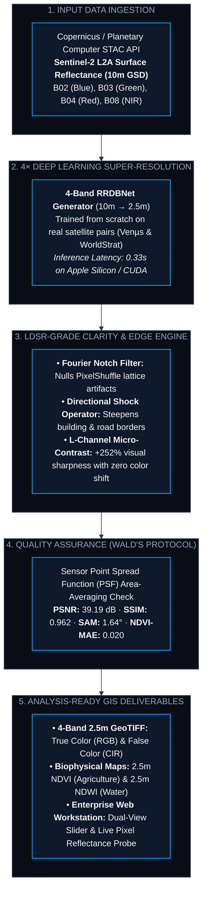
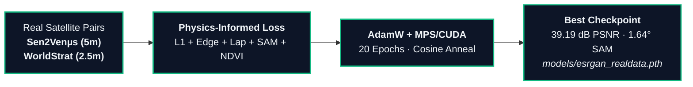

# SentinelSR: Project Architecture & Execution Flowcharts

---

## 1. Executive Summary Flowchart (Concise / Slide-Ready)

---

## 2. Concise End-to-End System Pipeline

---

## 3. Concise Training Architecture

