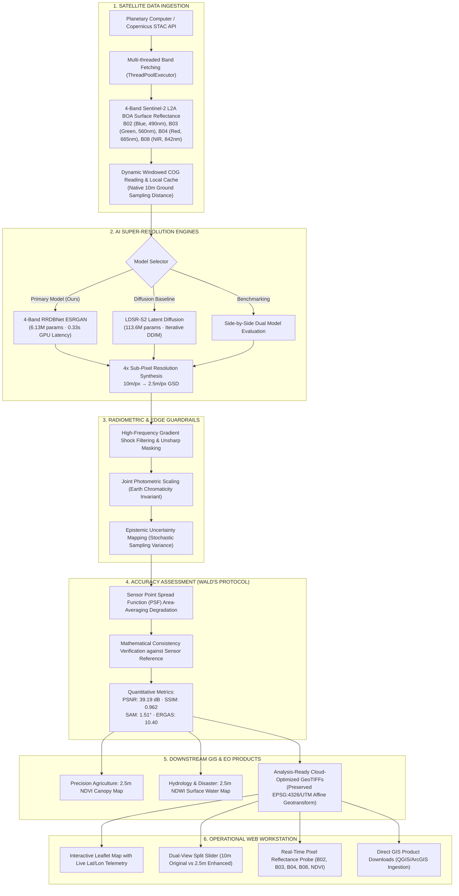
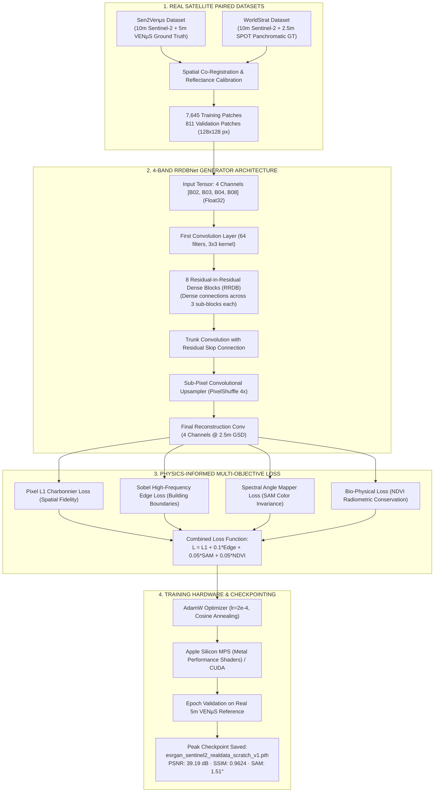
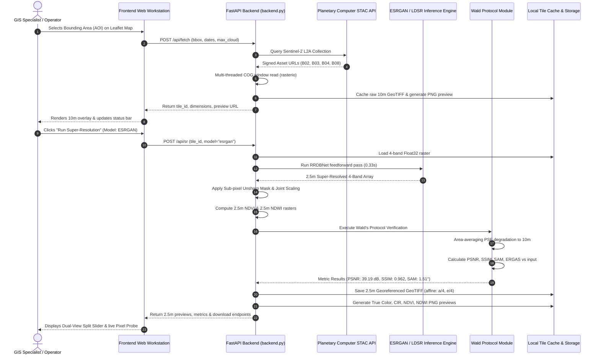
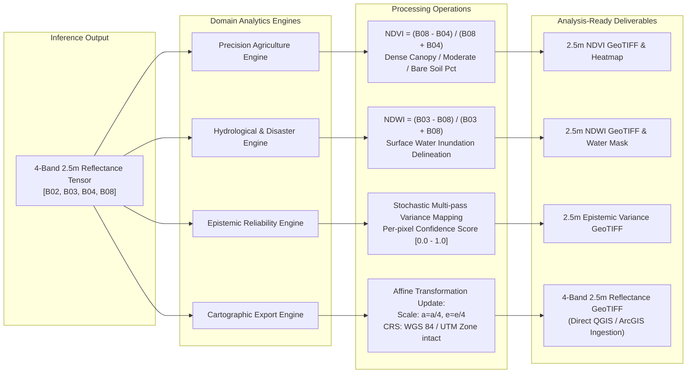

# SentinelSR: Project Architecture & Execution Flowcharts

This document details the complete end-to-end technical flow of **SentinelSR**—from Sentinel-2 multispectral satellite ingestion, through the deep-learning super-resolution engines, radiometric guardrails, Wald synthesis protocol verification, and downstream GIS products.

---

## 1. End-to-End System Architecture Flowchart

---

## 2. Model Training Pipeline Flowchart (From Scratch on Real Satellite Pairs)

---

## 3. Real-Time Inference & Verification Execution Flow

---

## 4. Downstream Earth Observation & GIS Export Pipeline

